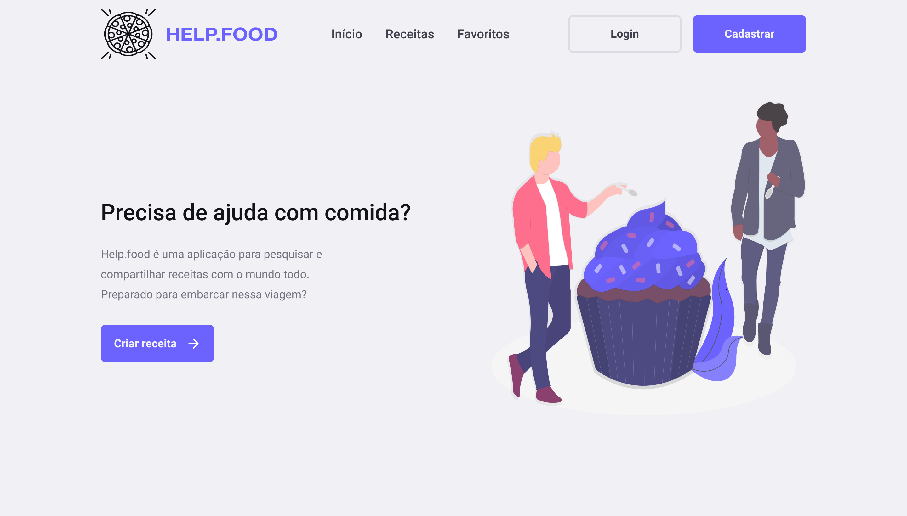

<h1 align="center" border-radius="5px" ></h1>

Help.food é uma aplicação para pesquisar e compartilhar receitas com o mundo todo.
Preparado para embarcar nessa viagem?

## Índice
- [Índice](#índice)
- [Sobre o Projeto](#sobre-o-projeto)
    - [Tecnologias](#tecnologias)

## Sobre o Projeto
O Help.food é um projeto que visa ajudar as pessoas de maneira fácil e intuitiva de procurar e publicar receitas mundo a fora!

Além disso, somos um projeto open-source onde você pode contribuir na evolução :)

## Tecnologias
  * [NextJS](https://nextjs.org/docs/getting-started) - Biblioteca para criar interfaces de usuário
  * [Yarn](https://yarnpkg.com/) - Gerenciador de pacotes e dependências
  * [Node](https://nodejs.org/en/) - Gerenciador de pacotes e dependências  

## Autores

 

